# Instagram-Application-

CS121 course tutorial on how to make an Instagram like application in under thirty minutes

The tutorial is provided by a YouTube channel named "Beginner Programmers". The link to the tutorial is provided below:
https://www.youtube.com/watch?v=MpFO4Zr0EPE

The following is an outline of the program's functions:

This is what the webpage looks like when you load it. Notice that the homepage is filled with previous posts. Currently, the user is not logged in.

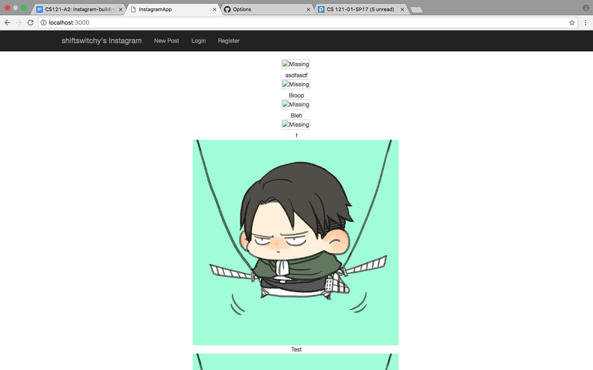

This is the register page.

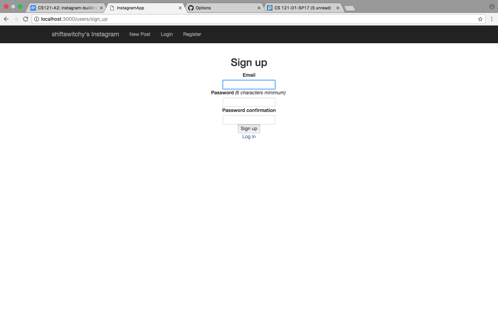

This is the register page filled with my own email and password choice.

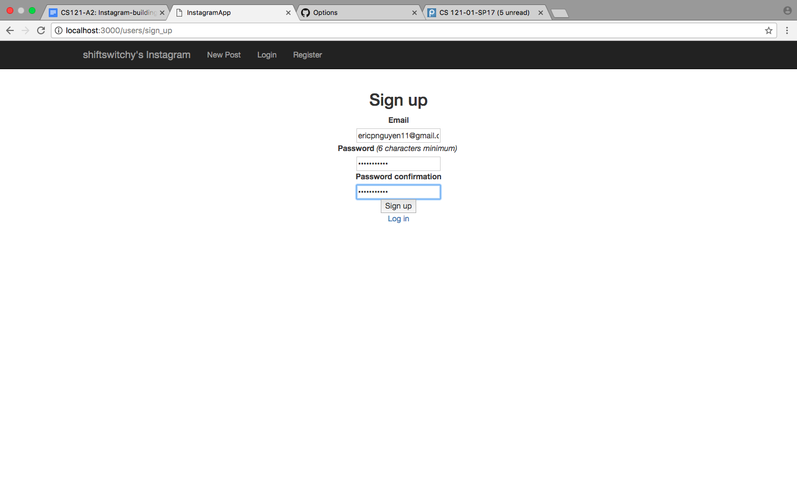

After clicking the sign up button, the user is redirected to the following page, confirming registration.

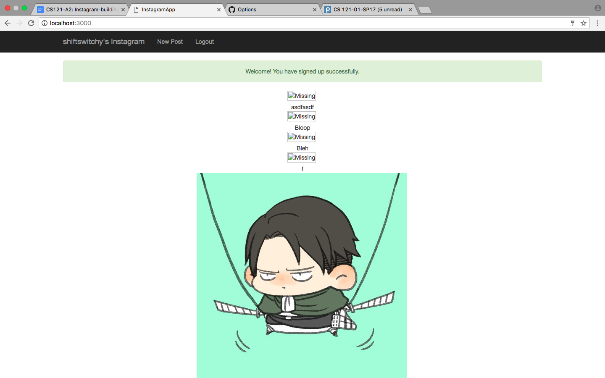

If the user clicks the "Logout" tab at the top of the webpage, a dialogue box will pop up asking for confirmation:

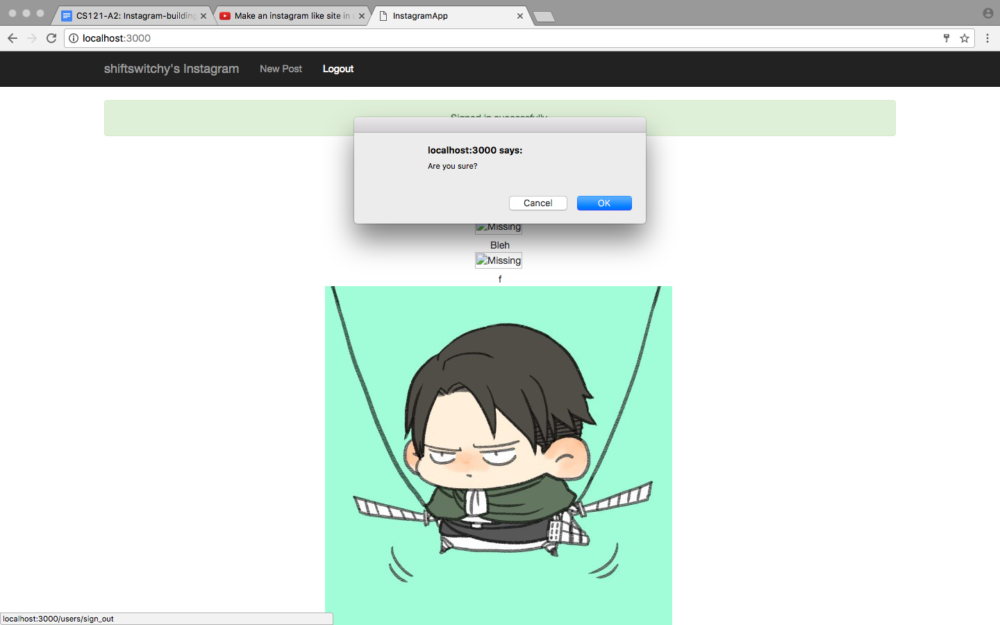

If the user decides to log out, they are redirected to a page containing a message box saying, "Signed out successfully".

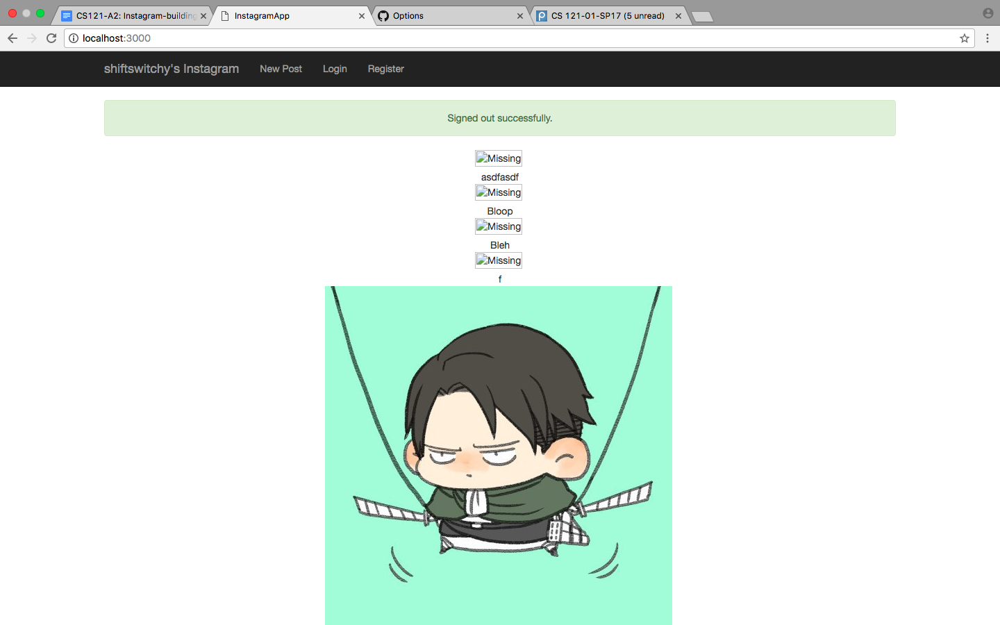

The following is the "Log in" page:

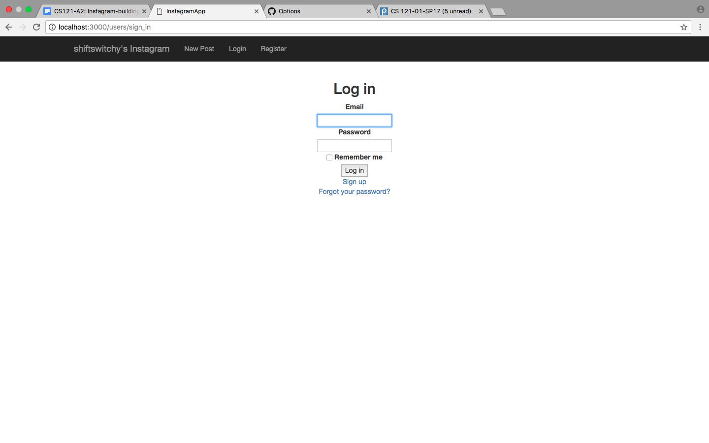

This is the log in page filled with my own email and password.

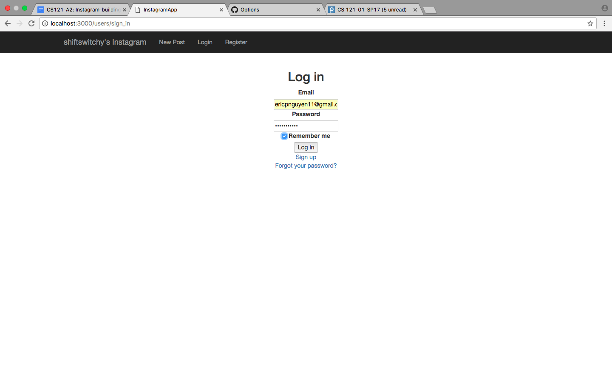

Upon clicking the "Log in" button, the user will be redirected to a page containing a message box saying, "Signed in successfully".

The screenshot below is the "New Post" page:

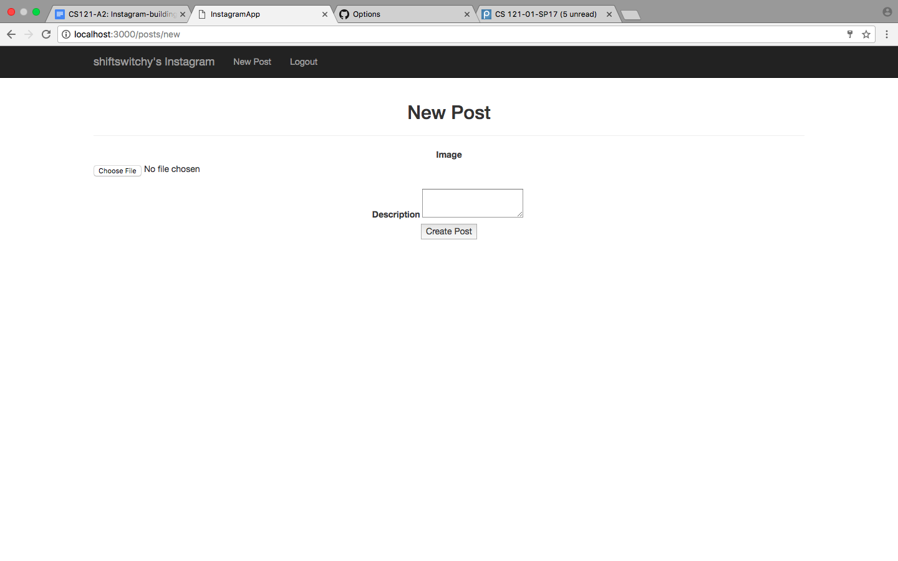

As you can see, I chose an image file and provided a description.

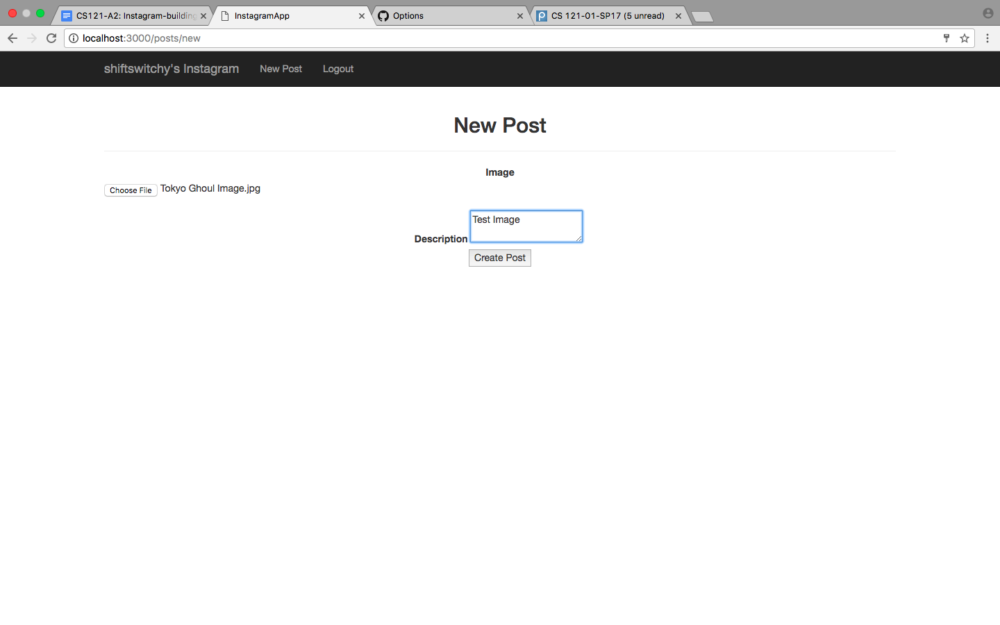

When the user clicks create post, they are redirected to their newly created post containing the message, "Success!".

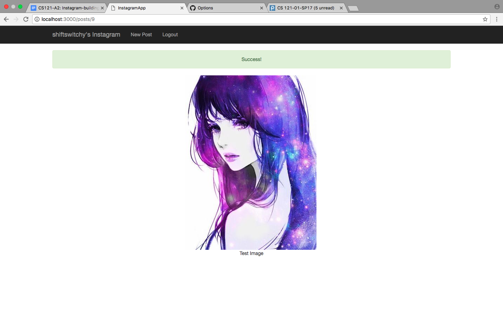

Finally, if the user clicks the home button, "shiftswitchy's Instagram", the user will be redirected to all their previous posts. Here, I show the newly created post on the home page:

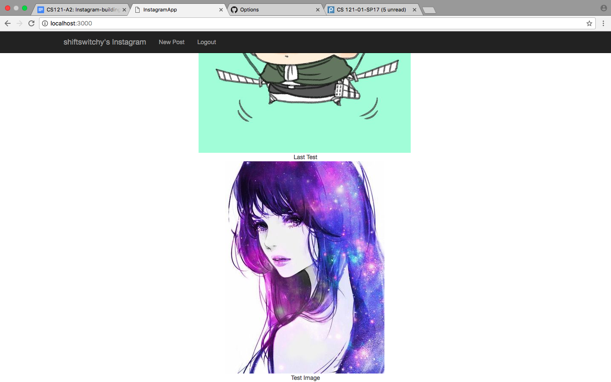
